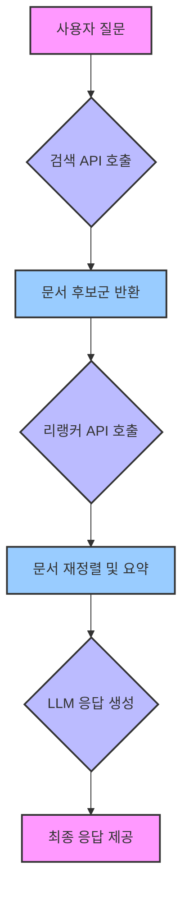

# 🚀 리랭커 기반 RAG 시스템 구현 예제: 더 강력한 LLM 활용을 위한 핵심!

최근 LLM을 활용한 **RAG(Retrieval-Augmented Generation) 시스템** 구축이 활발히 이루어지고 있습니다. 특히 방대한 데이터 속에서 사용자 질의에 **가장 적합하고 신뢰성 높은 정보를 찾아내는 것**이 핵심 과제로 떠오르고 있죠. 그 중에서도 검색 단계 이후 **가장 관련성 높은 정보를 정교하게 추려주는 Reranker** 기술이 주목받고 있습니다.

본 프로젝트는 리랭커 API를 활용한 RAG 시스템 구성 방식을 설명하며, CS와 같이 **정확도가 중요한 분야**에서 어떻게 활용될 수 있는지 보여줍니다.

---

## 📌 왜 리랭커가 필요한가요? - RAG 시스템의 한계를 넘어서

기존 검색 API는 사용자 쿼리에 대한 문서 후보를 다수 반환하지만, 단순히 키워드 기반의 일치 여부만을 판단하여 문맥과 의미를 정확히 반영하지 못하는 한계가 있습니다. 이로 인해 다음과 같은 비효율적이고 치명적인 문제가 발생할 수 있습니다:

-   **🔸 관련 없는 문서 포함으로 응답 품질 저하**: 검색 결과에 쿼리의 의도와 무관한 문서가 섞여 LLM이 혼란을 겪거나, 부정확한 정보를 기반으로 답변을 생성할 위험이 커집니다.
-   **💸 불필요한 토큰 낭비로 인한 비용 증가**: LLM은 입력되는 토큰 수에 따라 비용이 발생합니다. 관련 없는 문서까지 LLM에 전달하면 불필요한 토큰 소비로 이어져 운영 비용이 증가하게 됩니다.
-   **👻 잘못된 정보 기반 응답 생성(=환각 현상) 증가**: LLM이 관련성 낮은 정보나 잘못된 맥락의 데이터를 학습하여 실제와 다른 허위 정보를 생성하는 'Hallucination'이 발생할 확률이 높아져 답변의 신뢰도를 크게 떨어뜨립니다.

리랭커는 다음과 같은 방식으로 위 문제를 효과적으로 보완하며, RAG 시스템의 전반적인 성능을 혁신적으로 개선합니다:

-   **문서의 의미/맥락/질문 의도를 심층적으로 반영하여 재정렬**: 단순 키워드 매칭을 넘어, 질문과 문서 내용 간의 의미론적 유사성과 맥락을 분석하여 가장 유의미한 문서들을 우선순위에 놓습니다.
-   **가장 관련성 높은 문서만 LLM에 선별적으로 전달**: 불필요한 정보는 제거하고, LLM이 답변 생성에 꼭 필요한 '알짜배기' 정보만을 제공하여 효율성을 극대화합니다.
-   **결과적으로 응답 정확도와 신뢰도 모두 비약적으로 향상**: LLM이 양질의 정제된 정보를 바탕으로 답변을 생성하므로, 사용자에게 제공되는 정보의 정확성과 신뢰성이 크게 높아집니다.

---

## ⚙️ 리랭커의 작동 방식: 지능적인 정보 선별 과정

리랭커는 초기 검색으로 얻은 수많은 문서 중 사용자 쿼리와 **가장 관련성이 높은 문서**를 다시 정렬하고 필터링하는 고급 기술입니다. 이는 단순한 단어 일치가 아닌 **문맥, 의미, 질의 의도**를 종합적으로 고려하여 문서를 재평가하고 선별하는 과정을 거칩니다.

### 📄 처리 흐름 요약

리랭커가 통합된 RAG 시스템의 전체적인 정보 처리 흐름은 다음과 같습니다:

1.  **사용자 질문 입력**: 사용자가 LLM에 질의할 질문을 입력합니다.
2.  **→ 검색 API 호출**: 입력된 질문을 바탕으로 내부 데이터베이스 또는 외부 검색 엔진에서 관련 문서 후보군을 넓게 추출합니다.
3.  **→ 리랭커 API 호출**: 추출된 문서 후보군을 리랭커에 전달하여, 질문과의 관련성을 기준으로 문서를 재정렬하고 가장 유의미한 문서들로 압축합니다.
4.  **→ LLM 입력**: 리랭커를 통해 정제된 소수의 고품질 문서들을 LLM에 전달하여 답변 생성을 요청합니다.
5.  **→ 최종 응답 출력**: LLM이 생성한 정확하고 신뢰성 높은 최종 답변이 사용자에게 제공됩니다.

---

## 📁 프로젝트 구성 목적 및 기대 효과

이 저장소는 리랭커 기반 RAG 시스템의 기본 구조를 설명하여, 개발자들이 해당 기술을 쉽게 이해하고 자신의 프로젝트에 적용할 수 있도록 돕는 데 목적이 있습니다.

프로젝트 내의 `reranker.py` 파일은 위에서 설명한 전체 RAG 파이프라인의 핵심 로직을 담고 있습니다. 실제 서비스 적용 시 다음 항목들을 사용자 환경에 맞게 수정하고 최적화해야 합니다:

* `API 키, 엔드포인트, 파라미터`: 사용 중인 검색 API, 리랭커 엔진, LLM 종류에 따라 적절히 설정해야 합니다.
* `사용 중인 검색 API`: 데이터베이스 구조 및 검색 방식에 맞춰 통합해야 합니다.
* `리랭커 엔진, LLM 종류`: 비즈니스 요구사항과 성능/비용 목표에 맞는 모델을 선택하고 연동해야 합니다.

### ✅ 기대 효과: 리랭커 도입으로 얻는 실질적인 이점

리랭커를 RAG 시스템에 도입함으로써 다음과 같은 놀라운 효과를 기대할 수 있습니다.

* **정확도 향상**: 리랭커가 관련성 높은 문서만 LLM에 전달함으로써, LLM은 더 정교하고 정확한 응답을 생성할 수 있게 됩니다. 이는 특히 고객 만족도에 직결되는 CS 분야에서 매우 중요합니다.
* **토큰 효율성 및 비용 절감**: LLM에 전달되는 문서의 수가 줄어들어 LLM 토큰 사용 비용을 절감할 수 있으며, 동시에 LLM의 처리 속도 또한 향상시킬 수 있습니다.
* **환각 현상 감소**: 불필요하거나 관련 없는 정보가 LLM에 주입되는 것을 사전에 방지하여, 잘못된 답변 생성 가능성(환각 현상)을 현저히 줄여 답변의 신뢰도를 높입니다.

---

## 🧩 전체 시스템 구성도 (아키텍처)

리랭커 기반 RAG 시스템의 전체적인 아키텍처는 다음과 같습니다.

---

## 🔗 참고 사항 및 적용 분야

본 프로젝트는 리랭커 기반 RAG 시스템의 **구조 이해 및 테스트 목적의 예제**로 제공됩니다. 실제 프로덕션 환경에 적용 시 다음과 같은 추가적인 커스터마이징 및 고려 사항이 필요합니다:

-   **API 응답 처리 방식의 견고성 확보**
-   **프롬프트 구성 템플릿의 최적화** (Few-shot learning, Chain-of-Thought 등)
-   **리랭커/LLM 응답 후처리** (파싱, 포맷팅, 유효성 검사 등)
-   **에러 핸들링 및 로깅**

### 📌 다양한 적용 분야

리랭커 기반 RAG 시스템은 다음과 같이 다양한 분야에 적용되어 강력한 성능을 발휘할 수 있습니다:

* **기술 문의 챗봇**: 개발자 문서나 기술 Q&A에서 정확한 답변을 빠르게 찾아 제공.
* **헬프데스크/고객 상담**: 방대한 CS 지식 베이스에서 고객 질문에 대한 최적의 답변을 제시.
* **지식 검색 시스템**: 기업 내부 문서나 학술 자료 등에서 필요한 정보를 효율적으로 검색.
* **보고서/문서 자동 생성**: 특정 주제에 대한 최신 정보를 바탕으로 초안을 빠르게 생성.

이 프로젝트가 여러분의 RAG 시스템 구축 여정에 도움이 되기를 바랍니다!
